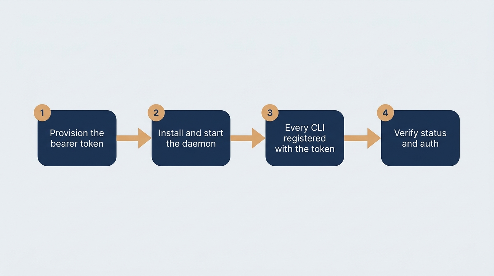

# Runbook — Shared MemPalace MCP HTTP server

<!-- crewrig-doc: published=false -->

Operational guide for the shared MemPalace MCP HTTP daemon introduced by
[ADR 0016](../adr/0016-shared-mempalace-mcp-http-server.md) (spec 0113,
tracked under issue #751 / spec 0136 for this documentation). The daemon
holds the palace writer lease on behalf of every converted CLI session —
Claude Code, Gemini CLI, Copilot CLI, and Antigravity CLI — so concurrent
sessions stop contending for it (MCP error `-32001`, *"Peer MCP writer
active"*). See the [CLI support matrix](../cli-matrix.md) rows 7c, 7d and 10
for the per-CLI registration shapes, the launch-time version guard, and the
setup-script wiring; this runbook does not restate those facts.

This daemon is **tier 2** of the two-layer coordination topology; **tier 1**
is the shared ChromaDB daemon documented in
[its own runbook](chroma-http-server.md) (ADR 0006). Tier 1 must already be
serving before tier 2 will start — the daemon waits for it on a bounded
deadline and refuses to start if it never becomes reachable.

## Prerequisites

- **MemPalace** installed at the pinned version:
  `pipx install 'mempalace>=3.6.0,<3.7'` (`task install-mempalace`).
- **The shared ChromaDB daemon (tier 1) already running** — see
  [the ChromaDB runbook](chroma-http-server.md). The launcher waits up to
  `MEMPALACE_MCP_CHROMA_WAIT` seconds (default `60`) before giving up.
- **Free TCP port `41893` on `127.0.0.1`**. Override with `MEMPALACE_MCP_PORT`
  (the launcher and the CLI-registration helper both honor it).

## Converting a machine

Converting is all-or-nothing across the four CLIs, run once per machine:

```sh
task mempalace:switch-http
```

1. Provisions a bearer token if one does not already exist for this palace
   — this happens **first**: the daemon launcher refuses to start without
   one, by design (`install_mcp_daemon`, `scripts/lib/common.sh:812-830`).
2. Installs the daemon launcher and starts it under the supervisor (launchd
   on macOS, systemd user unit on Linux), which waits for the daemon to
   report healthy.
3. Registers every supported CLI against it, over `--transport http`.
4. Re-runs the status check so the conversion is verified, not merely
   assumed.

**Already-running sessions keep their previous memory server until they
restart** — restart every open CLI session to actually pick up the change.
This is a separate, order-independent follow-up rather than a step in the
sequence above, so it is not depicted in the diagram below.

A single CLI can be converted on its own by re-running that CLI's own
`setup-*-interactive.sh`; the machine-wide, all-four-CLIs-or-none obligation
belongs only to `task mempalace:switch-http`.



## Daily operations

| Action | Command |
|---|---|
| Convert / (re)install and start | `task mempalace:switch-http` |
| Check status | `task mempalace:status` (`bash scripts/status-mcp-server.sh`) |
| Restart | `task mempalace:stop` (`bash scripts/stop-mcp-server.sh`) — see caveat below |
| End the daemon | `task mempalace:uninstall-daemon` |

### Stopping is not uninstalling

Under the installed supervisor (launchd `KeepAlive=true` / systemd
`Restart=always`), `task mempalace:stop` is a **restart request**, not a
shutdown — the supervisor brings the daemon straight back within seconds.
Use it to pick up a config change or clear a wedged process, not to end the
daemon.

To actually end the daemon and remove its supervisor unit, run
`task mempalace:uninstall-daemon` instead. Run this **before** reverting the
change that introduced the daemon: the installed launcher lives outside the
repository, at `~/.crewrig/mcp-daemon-launcher.sh` (deliberately, so a
`git revert` cannot delete the program the supervisor's `ExecStart` names),
and the idle watchdog that reaps stale per-session servers is disabled for
this shared daemon by design — nothing else will stop it from autostarting
forever once the unit is orphaned.

### Logs

- **All platforms** — `~/.mempalace/mcp-server.log` (stdout + stderr of the
  supervised process).
- **macOS specifics** —
  `launchctl print gui/$(id -u)/com.mempalace.mcp-server` for the
  supervisor's own diagnostics.
- **Linux specifics** — `journalctl --user -u mempalace-mcp-server`.

### Checking it is actually serving, and actually authenticated

`bash scripts/status-mcp-server.sh` (`task mempalace:status`) is the
operator's only window onto liveness, onto whether the bearer check is
*actually* enforced, onto launcher drift, and onto which arrangement each of
the four CLIs is registered under — nothing else surfaces these once
sessions stop launching their own memory server. Checking `/healthz` alone
is not enough: it is served with `require_auth=False` and returns `200` in
every state, including one where authentication is silently off.

## Troubleshooting

### `Address already in use` on the daemon's port (default `41893`)

The launcher probes the port before starting and refuses immediately rather
than letting the supervisor retry forever against a port that will not free
itself:

```sh
netstat -anv | grep 41893
```

`lsof` can show nothing here even when the port is genuinely held — a system
service running under launchd is invisible to it without elevated
privileges, which is why `netstat` is the diagnostic of record. Either stop
the holder, or move the daemon to a different port and re-convert:

```sh
MEMPALACE_MCP_PORT=<port> task mempalace:switch-http
```

### Daemon not starting after boot

- **macOS** — `launchctl print gui/$(id -u)/com.mempalace.mcp-server` shows
  the last exit status; check `~/.mempalace/mcp-server.log` for the
  underlying error.
- **Linux** — `systemctl --user status mempalace-mcp-server` and
  `journalctl --user -u mempalace-mcp-server -n 200`.

A daemon that will not start because tier 1 is unreachable reports that
directly in the log, naming
[the ChromaDB runbook's](chroma-http-server.md) status command to check next.

## Replacing the bearer token

When you need to rotate the bearer token (for instance, after a suspected
leak), follow the four-step manual procedure below. Re-running the switch
script mints a fresh token, replaces the running daemon process so the new
token takes effect immediately, and re-registers every assistant CLI with the
new credential.


1. **Delete the current token file.** Its path is derived from the palace
   path the same way the daemon derives it (`scripts/lib/common.sh`,
   `mcp_token_path`); from the repository root:

   ```sh
   rm -f "$(source scripts/lib/common.sh && mcp_token_path)"
   ```

2. **Re-run the conversion:**

   ```sh
   task mempalace:switch-http
   ```

   Finding no token file, this mints a fresh one, replaces the running
   daemon process under the supervisor (`mcp_daemon_replace_process`), and
   re-registers every CLI with the new credential. **This is the point at
   which the superseded token stops being honored** (spec 0139) — the switch
   script verifies that the new token is served before updating any CLI
   registration, and fails visibly rather than leave a running daemon
   honouring the stale credential.

   > [!WARNING]
   > **Replacement-window residual risk (spec 0139 delta-01 R5):** During the
   > brief process replacement window in step 2 (between terminating the old
   > daemon and binding the new listener), the supervisor port is temporarily
   > released. On an untrusted multi-user system, another local process could
   > theoretically bind the released port before the daemon relaunches; in that
   > event, the switch script fails when probing the listener.

3. **Delete each CLI's stale backup config.** Step 2's re-registration backs
   up each assistant's config file with a timestamp suffix before
   overwriting it, and every backup still contains the *old* token:

   ```sh
   ls ~/.claude.json.bak.* ~/.gemini/settings.json.bak.* \
      ~/.copilot/mcp-config.json.bak.* ~/.gemini/config/mcp_config.json.bak.* \
      2>/dev/null
   ```

   Remove whichever of these exist on this machine.

4. **Restart every running CLI session** so it picks up the new token —
   exactly as after a first conversion, a session already running keeps
   using the value it started with.

To decommission a palace's token entirely instead of rotating it, remove its
whole server directory: `rm -rf "$(dirname "$(source scripts/lib/common.sh && mcp_token_path)")"`.
